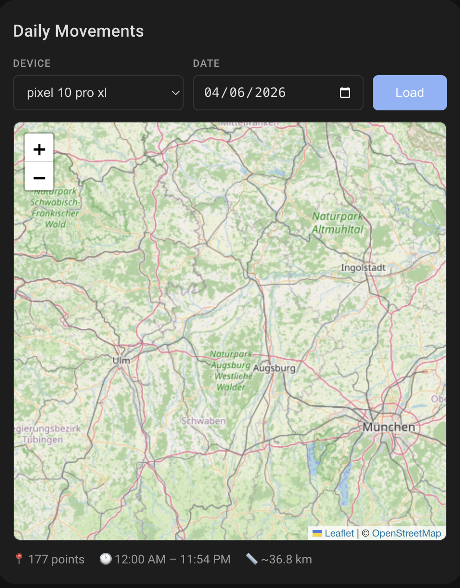

# lovelace-track-history-card

A custom Lovelace card for [Home Assistant](https://www.home-assistant.io/) that displays the GPS movement history of any `device_tracker` entity on an interactive map for a selected day.


<p align="center">
  
  <br>
  <sub>Datapoints have been intentionally removed from this screenshot</sub>
</p>

---

## Features

- Select any `device_tracker` entity from a configurable list
- Date picker to browse any past day
- Renders a full movement path as a polyline on an [OpenStreetMap](https://www.openstreetmap.org/) map (via Leaflet)
- **Start** (green) and **End** (red) pin markers with popup details
- Intermediate waypoints with timestamp, GPS accuracy and entity state on click
- Summary bar with total points, time range, and approximate distance
- Adapts to the Home Assistant theme (light / dark)

---

## Requirements

- Home Assistant **2023.0** or newer
- The [Recorder](https://www.home-assistant.io/integrations/recorder/) integration enabled (default in HA)
- At least one `device_tracker` entity with GPS attributes (`latitude`, `longitude`)
- Internet access from the browser to load Leaflet from `unpkg.com` (see [Offline usage](#offline-usage))

---

## Installation

### Via HACS (recommended)

1. Open **HACS** → **Frontend**
2. Click the three-dot menu → **Custom repositories**
3. Add `https://github.com/sergon2000/lovelace-track-history-card` as type **Lovelace**
4. Search for **Track History Card** and install it
5. Reload your browser

### Manual

1. Download `lovelace-track-history-card.js` from the [latest release](https://github.com/sergon2000/lovelace-track-history-card/releases)
2. Copy it to `/config/www/lovelace-track-history-card.js`
3. In Home Assistant go to **Settings → Dashboards → Resources**
4. Add `/local/lovelace-track-history-card.js` as type **JavaScript module**
5. Reload your browser

---

## Configuration

The card supports a **visual editor** — click the pencil icon after adding the card to configure it without writing YAML. Fields available:

- **Title** — card header text
- **Tracked devices** — add / remove `device_tracker` entities with an autocomplete picker
- **Default device** — entity pre-selected on load (dropdown populated from the list above)
- **Map height** — map height in pixels

Alternatively, configure it manually via YAML:

```yaml
type: custom:lovelace-track-history-card
title: "Daily Movements"
entities:
  - device_tracker.john_phone
  - device_tracker.jane_iphone
  - device_tracker.car_tracker
default_entity: device_tracker.jane_iphone
map_height: 450
```

### Options

| Option | Type | Default | Description |
|---|---|---|---|
| `entities` | `list` | **required** | One or more `device_tracker` entity IDs to show in the device dropdown |
| `title` | `string` | `Movement History` | Card title displayed in the header |
| `default_entity` | `string` | first entity | Entity pre-selected in the dropdown on load. Must be present in `entities`. If omitted or not found, the first entity is used. |
| `map_height` | `number` | `400` | Map height in pixels |

---

## Usage

1. Select a **device** from the dropdown (lists all entities defined in `entities`)
2. Pick a **date** using the date picker (today or any past day)
3. Click **Load** — the card queries the HA History API and draws the path on the map
4. Click any point on the map to see its timestamp, GPS accuracy and entity state
5. The summary bar below the map shows the total number of recorded points, the time range, and the approximate distance travelled

---

## Offline usage

By default, Leaflet is loaded from `https://unpkg.com`. If your Home Assistant instance has no outbound internet access from the browser, you can self-host Leaflet:

1. Download `leaflet.js` and `leaflet.css` from [leafletjs.com](https://leafletjs.com/download.html)
2. Place both files in `/config/www/leaflet/`
3. Open an issue or fork the repo and point the constants at the top of the JS file to `/local/leaflet/leaflet.js` and `/local/leaflet/leaflet.css`

---

## License

MIT © [sergon2000](https://github.com/sergon2000)
